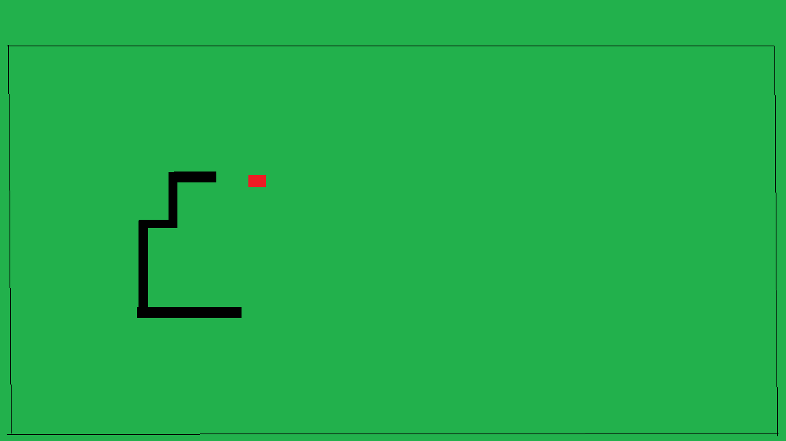

# Harjoitustyön suunnitelma

## Tietoja 

Tekijä: Mikko Ralli

Työ git-varaston osoite: <https://github.com/MikkoRall/Ohjelmointi1Harjoitustyo.git>

Pelin nimi: Matopeli2024

Pelialusta: Windows

Pelaajien lukumäärä: 1

## Pelin tarina

Pelin mato on jatkuvasti nälkäinen ja mato janoaa jatkuvasti uusia makupaloja. Mato haluaa syödä niin paljon makupaloja kuin mahdollista ja kasvaa mahdollisimman suureksi eli pitkäksi.

## Pelin idea ja tavoitteet

Pelin ideana on saada mato syömään mahdollisimman paljon makupaloja ja kasvattaa mato mahdollisimman pitkäksi. Jokaisesta makupalasta saa yhden pisteen. Peli loppuu, jos mato törmää reunaan tai itseensä.

## Hahmotelma pelistä

(Kun olet lisännyt suunnitelmakuvan tähän hakemistoon, linkitä se tähän alle. Alla on esimerkkikuvan linkitys.)

## Toteutuksen suunnitelma

Helmikuu

- Luon madon valmiiksi
- Luon syötävän valmiiksi
- Teen pelialueen ja luon pistelaskun

Maaliskuu

- Suunnittelen madon nopeuden
- Suunnittelen ja toteutan pelin lopun
- Testaan, että peli toimii

Jos aikaa jää

- Teen toisen kentän ja esimerkiksi esteitä kentälle
- Teen madosta nopeutuvan pelin edetessä
- Onnistuuko pelistä tehdä kaksinpeliä
